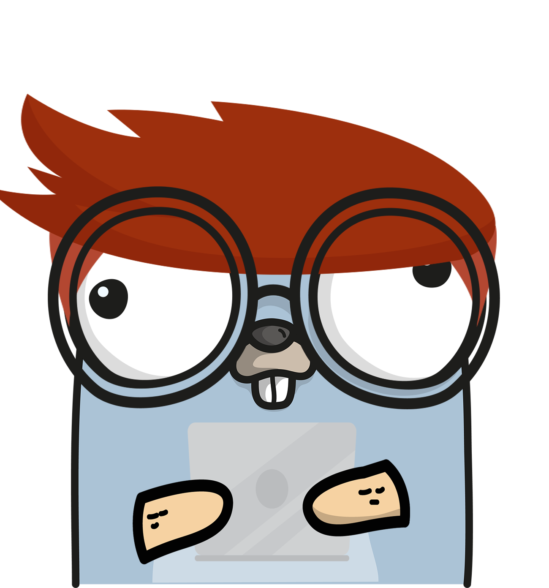

# Go-Network
### The Go-to package for Network Analysis in Go



Go-Network is a Go package for the creation, manipulation, and study of the structure, dynamics, and functions of complex networks. The implemented methods cover multiple workshops, conferences (e.g,. INFOCOM, SIGCOM, KDD, TKDD, ICDE), and journals.

#### Supported graph generation algorithms
- Classic algorithms
  - [Circular ladder graph]()
  - [Circulant graph]()
  - [Complete graph]()
  - [Cycle graph]()
  - [Empty graph]()
  - [Ladder graph]()
  - [Lollipop graph]()
  - [Null graph]()
  - [Path graph]()
  - [Star graph]()
  - [Tadpole graph]()
  - [Trivial graph]()
  - [Turán graph]()
  - [Wheel graph]() 

- Random graphs
  - [Barabasi-Albert]()
  - [Dense Random graph]()
  - [Erdős-Rényi]()
  - [Watts-Strogatz]()

- From time series
  - [TBD]()

#### Supported graph sampling algorithms
 - [Random Node]()
 - [Random Degree Node]()
 - 


# Contribution Guidelines

Thank you for considering contributing to our project! Before you start, please take a moment to read the following guidelines.

You can join our Slack channel [here](https://join.slack.com/t/go-networkworkspace/shared_invite/zt-2c6zzo6hy-xmbwJrly~nIobfqsVxRbpg).

## Version Support

Our project supports features for Go 1.21 and above. Please ensure that any contributions adhere to this version requirement.

## Unit Tests

Every new feature, bug fix, or improvement should be accompanied by its own set of unit tests. These tests are crucial for maintaining the reliability and stability of the project.

## Code Linting

We use `golangci-lint` as our code linter to ensure consistent code quality. Before submitting your contribution, run the following command locally to check for linting issues:

```bash
golangci-lint run
```

Make sure that your code passes the linter without any errors or warnings.

If you don't have `golangci-lint` installed, you can find installation instructions on [the official linters page](https://golangci-lint.run). Make sure to install the version compatible with the project (1.54.2).

## Pull Requests
When submitting a pull request, please provide a clear and detailed description of your changes. Ensure that your code is well-documented, follows the project's coding standards, and addresses the issue or feature request.

Thank you for contributing to our project! We appreciate your time and effort in making our project better.
